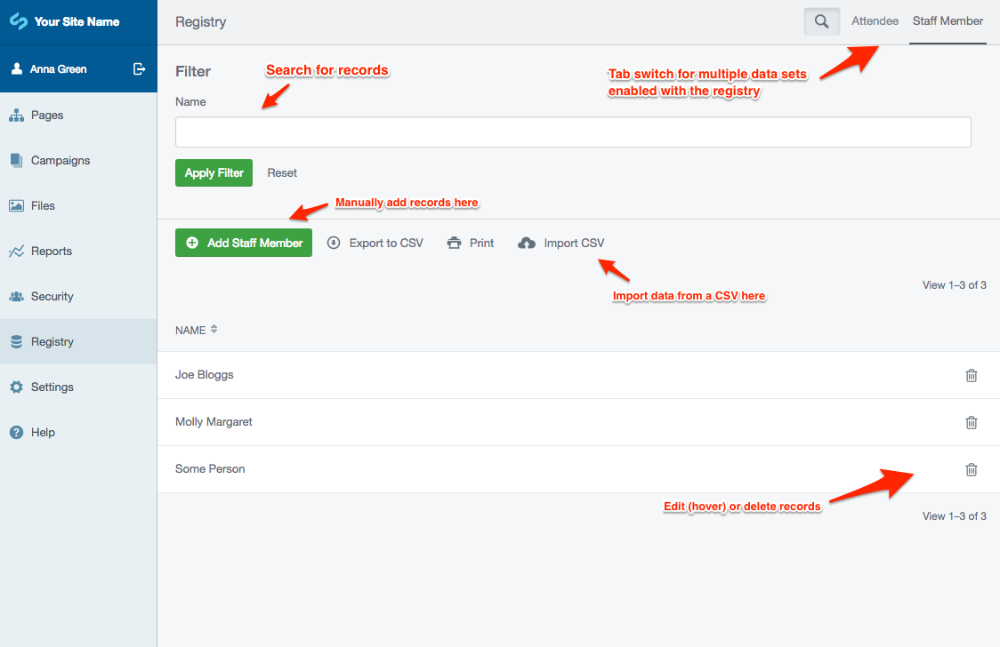

# Registry module

## Introduction

This module allows a website user to search, find details for, and export search results
for a particular type of data.

One example this could be used for is a listing of staff members.

## Instructions

To use the registry module, you need to define the data you wish to store and then set up the pages
to search through the data.

### Defining the data

Each registry is a list of a single class of DataObject.

A DataObject must implement `RegistryDataInterface` and the
`getSearchFields` abstract function to be picked up by this module.

In this example we've created a `StaffMember` class:

```php
<?php

use SilverStripe\Forms\FieldList;
use SilverStripe\Forms\TextField;
use SilverStripe\ORM\DataObject;
use SilverStripe\Registry\RegistryDataInterface;

class StaffMember extends DataObject implements RegistryDataInterface
{
    private static $db = [
        'Name' => 'Varchar(255)',
        'PhoneNumber' => 'Varchar(50)',
    ];

    public function getSearchFields()
    {
        return FieldList::create(
            TextField::create('Name'),
            TextField::create('PhoneNumber')
        );
    }
}
```

Once that's defined, we run `dev/build` to build the database with the new class.

### Managing the data



Pictured above is a summary of the admin area for managing registry data.

Multiple tabs will appear if you have multiple classes implementing `RegistryDataInterface`.

#### Importing data

On the left under *Filter* is a panel for uploading a CSV with data for that particular registry. A link
for toggling the specification is provided, so you can match the column headers in your CSV file to the
database columns. *Clear Database before import* will truncate the table for that data before importing
the new one, useful if you have a master CSV copy of staff members, for example, and you don't want it
to create duplicates on each import.

### Viewing the data

Create a new **Registry Page**. In the Content tab, find the *Data class* drop down
and set it to the class you just created, in this case **Staff Member**.

Save and Publish the page and view it in the front end.

### Changing the search results columns

SilverStripe has a built-in way of defining summary fields on a DataObject. You can do that by defining
the static `$summary_fields` in the DataObject definition. The array is a map of `$db` column name to
a viewable title the user will see. In this example we're adding the phone number to the summary list.

```php
<?php

use SilverStripe\ORM\DataObject;
use SilverStripe\Registry\RegistryDataInterface;

class StaffMember extends DataObject implements RegistryDataInterface
{
    //...
    private static $summary_fields = [
        'Name' => 'Name',
        'PhoneNumber' => 'Phone number',
    ];
    //...
}
```

Now when you view the staff member listing on the **Registry Page** it will show the two columns we
defined above.

This summary definition will also be used in the *Registry* tab of the CMS.

### Creating a detailed view of a search result

Sometimes the records listed you'll want a user to click through and see more details.

You can do this by defining the `Link` method on your registry class. For example:

```php
<?php

use SilverStripe\ORM\DataObject;
use SilverStripe\Registry\RegistryDataInterface;

class StaffMember extends DataObject implements RegistryDataInterface
{
    //...
    public function Link($action = 'show')
    {
        $page = RegistryPage::get()->filter('DataClass', StaffMember::class)->First();
        return Controller::join_links($page->Link(), $action, $this->ID);
    }
    //...
}
```

This method can return a link to any place you wish. The above example will link to
the `show` action on the `RegistryPage` for `StaffMember`. Note that this assumes that there is
only a single `RegistryPage` displaying that type of data object.

The default template `RegistryPage_show.ss` is very simple and only shows a debug
representation of the data. See *Overriding templates* below on how to change this
template.

### Navigation breadcrumbs

When viewing data through the `show` action, the title of the current item will be appended to the
end of the breadcrumbs array. The title will be picked up in the default way of DataObject: it will
first look for `Title`, then for `Name`, then default to the `ID`.

### Overriding templates

While the default template does its best to be functional and easy-to-style, it's quite likely that
you'll need to change the templates. You can do so by placing the templates `RegistryPage.ss` and
`RegistryPage_show.ss` in your themes `templates/SilverStripe/Registry/Layout` folder. You can base these off the
files found in `vendor/silverstripe/registry/templates/SilverStripe/Registry/Layout`.

As a further layer of customisation, you can create templates that will be only used when viewing
specific registries. So if you wanted to create a template that would only be used to view the
StaffMember registry, you would create `My/Namespaced/StaffMember_RegistryPage.ss` and `My/Namespaced/StaffMember_RegistryPage_show.ss`

## Contributing

### Translations

Translations of the natural language strings are managed through a third party translation interface, transifex.com. Newly added strings will be periodically uploaded there for translation, and any new translations will be merged back to the project source code.

Please use [https://www.transifex.com/projects/p/silverstripe-registry](https://www.transifex.com/projects/p/silverstripe-registry) to contribute translations, rather than sending pull requests with YAML files.
