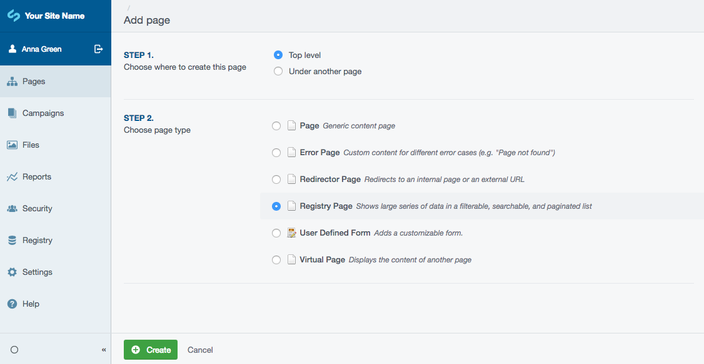

title: Online databases and registries
summary: How to manage databases and registries using the CMS

## In this section:

* An overview of the registry CMS interface

## Before we begin
Make sure that your SilverStripe installation has the [Registry](http://addons.silverstripe.org/add-ons/silverstripe/registry) module installed.

This module provides a page type that you can use to display a data registry on your website.

# Registry

SilverStripe CMS websites can publish data held in their databases for users to access (alongside traditional web pages). For example, you might publish a database of all of the schools in the country, or a registry of people holding a qualification, so that website visitors can find information they seek.

The built-in features:

* a public search form
* see data summarised in a list, and drill into detail on an item by item basis.
* export to CSV (and RESTFul API)
* CMS Administrators can bulk upload data via CSV or edit items one by one using an online form

A website developer is needed initially to create the “database” that can then be readily managed and interacted with using the CMS.

## Adminstration of registry data

Pictured above is a summary of the admin area for managing registry data.

## Adding a registry page

To share a set of registry data publicly on your website:

1. In the `Pages` section of the CMS click "Add new" then select "Registry Page"
2. Name your page and select from the dropdown "Data Class" the set of data to make public (the set has to have previously been enabled by a web developer).
3. Set the number of items to display per page and then publish your page.
4. The data set will now be available and searchable on your website.

